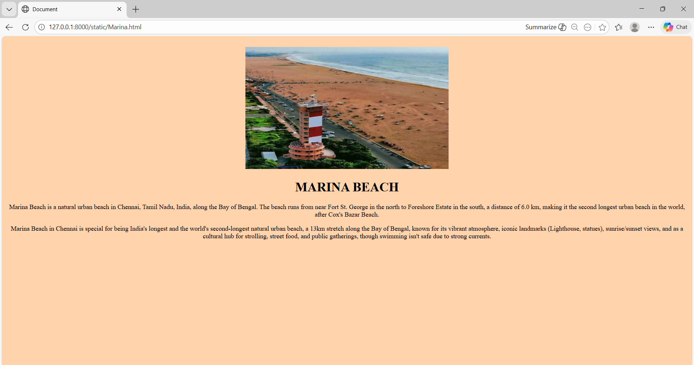
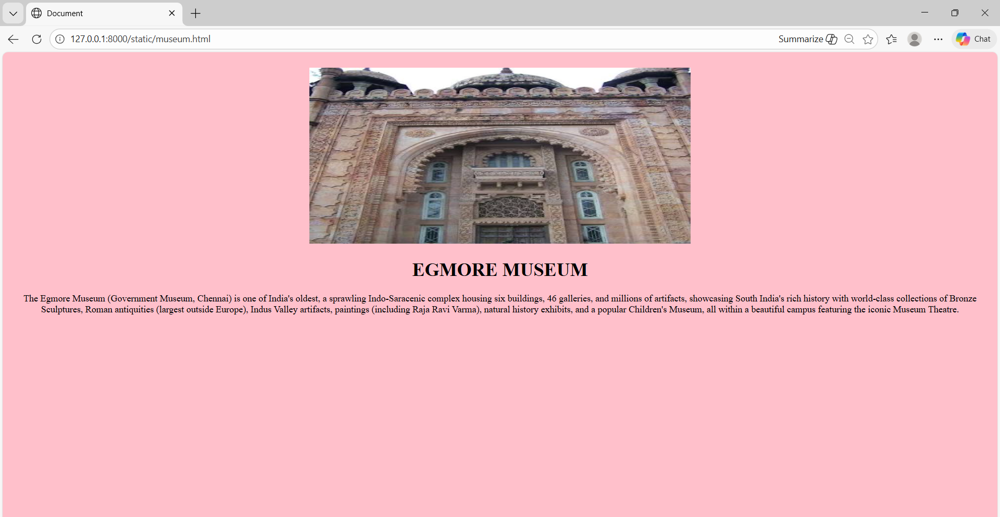
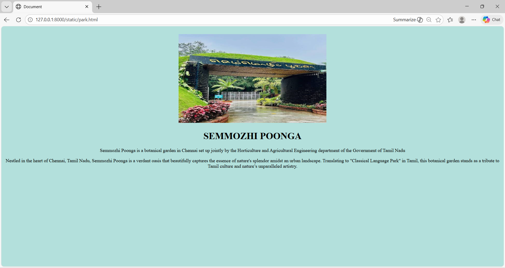

# Ex04 Places Around Me
## Date: 26/12/2025

## AIM
To develop a website to display details about the places around my house.

## DESIGN STEPS

### STEP 1
Create a Django admin interface.

### STEP 2
Download your city map from Google.

### STEP 3
Using ```<map>``` tag name the map.

### STEP 4
Create clickable regions in the image using ```<area>``` tag.

### STEP 5
Write HTML programs for all the regions identified.

### STEP 6
Execute the programs and publish them.

## CODE
map.html
```
<!DOCTYPE html>
<html lang="en">
<head>
    <meta charset="UTF-8">
    <meta name="viewport" content="width=device-width, initial-scale=1.0">
    <title>NearMe</title>
</head>
<body>
    <h1 align="center">
        <font color="crimson">CHENNAI</font>
    </h1>
    <h2 align="center">
        <font color="dark pink"> ASHNA.M 25018797</font>
    </h2>
    <center>
    

<map name="image-map" >
    <area target="" alt="" title="Marina Beach" href="Marina.html" coords="1585,462,1779,586" shape="rect">
    <area target="" alt="" title="Kapaleeshwarar Temple" href="temple.html" coords="1374,364,1558,469" shape="rect">
    <area target="" alt="" title="Semmozhi poonga" href="park.html" coords="1125,453,1281,598" shape="rect">
    <area target="" alt="" title="Egmore Museum" href="museum.html" coords="1125,453,1281,598" shape="rect">
</map>
    </center>
</body>
</html>

```
Marina.html
```
<!DOCTYPE html>
<html lang="en">
<head>
    <meta charset="UTF-8">
    <meta name="viewport" content="width=device-width, initial-scale=1.0">
    <title>Document</title>
</head>
<body bgcolor="#FFD3AC">
    <center>
        <br>
        
        <h1>MARINA BEACH</h1>

    <p>Marina Beach is a natural urban beach in Chennai, Tamil Nadu, India, along the Bay of Bengal. The beach runs from near Fort St. George in the north to Foreshore Estate in the south, a distance of 6.0 km, making it the second longest urban beach in the world, after Cox's Bazar Beach.</p>
    <p>Marina Beach in Chennai is special for being India's longest and the world's second-longest natural urban beach, a 13km stretch along the Bay of Bengal, known for its vibrant atmosphere, iconic landmarks (Lighthouse, statues), sunrise/sunset views, and as a cultural hub for strolling, street food, and public gatherings, though swimming isn't safe due to strong currents.  </p>
    </center>
</body>
</html>

```
museum.html
```
<!DOCTYPE html>
<html lang="en">
<head>
    <meta charset="UTF-8">
    <meta name="viewport" content="width=device-width, initial-scale=1.0">
    <title>Document</title>
</head>
<body bgcolor="pink">
    <center>
        <br>

<h1>EGMORE MUSEUM</h1>
    <p>The Egmore Museum (Government Museum, Chennai) is one of India's oldest, a sprawling Indo-Saracenic complex housing six buildings, 46 galleries, and millions of artifacts, showcasing South India's rich history with world-class collections of Bronze Sculptures, Roman antiquities (largest outside Europe), Indus Valley artifacts, paintings (including Raja Ravi Varma), natural history exhibits, and a popular Children's Museum, all within a beautiful campus featuring the iconic Museum Theatre.  </p>
    </center>
</body>
</html>

```
park.html
```
<!DOCTYPE html>
<html lang="en">
<head>
    <meta charset="UTF-8">
    <meta name="viewport" content="width=device-width, initial-scale=1.0">
    <title>Document</title>
</head>
<body bgcolor="#B3E0DC">
    <center>
        <br>
        
        <br>
        <h1>SEMMOZHI POONGA</h1>
    <p>Semmozhi Poonga is a botanical garden in Chennai set up jointly by the Horticulture and Agricultural Engineering department of the Government of Tamil Nadu</p>
    <p>Nestled in the heart of Chennai, Tamil Nadu, Semmozhi Poonga is a verdant oasis that beautifully captures the essence of nature's splendor amidst an urban landscape. Translating to "Classical Language Park" in Tamil, this botanical garden stands as a tribute to Tamil culture and nature’s unparalleled artistry.</p>
    </center>
</body>
</html>
```
temple.html
```
<!DOCTYPE html>
<html lang="en">
<head>
    <meta charset="UTF-8">
    <meta name="viewport" content="width=device-width, initial-scale=1.0">
    <title>Document</title>
</head>
<body bgcolor="pink">
    <center>
        <br>

<h1>KAPALEESHWARAR TEMPLE</h1>
    <p>One of the imposing religious sites of Chennai city is the noted Kapaleeswarar Temple that is majestically set in the Mylapore region of Chennai. It is said the Shiva Lingam in the temple is Swayambulingam, which means it is self-manifested. </p>
    </center>
</body>
</html>

```


## OUTPUT
.png>)



.png>)


## RESULT
The program for implementing image maps using HTML is executed successfully.
